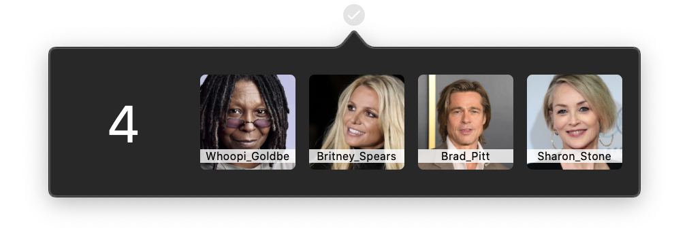

# IDV 300

<h3 align="center">Trystan Rivers 2020</h3>
 

  <h3 align="center">ML Attendance</h3>
   
  

    
  

  
  

    Let Machine Learning take care of attendance.
     
    <a href="#about-the-project"><strong>Explore the docs »</strong></a>
  

## Table of Contents

* [About the Project](#about-the-project)
  * [Built With](#built-with)
* [App Features](#app-features)
* [User Guide](#user-guide)
  * [Installing and running the project](#installing-and-running-the-project)
  * [Using the app](#using-the-app)
  * [Considerations](#considerations)
* [Plagiarism](#plagiarism)

## About The Project

A face recognition auto attendance app which effectively works with any single electronic method of online learning.

ML Attendance is a Swift app with a Python interface.

The brief for this project was to conceptualise and develop any TensorFlow-based artificial intelligence project with positive social impact and "wow-factor" using any language, development environment or framework of our choice. By doing this project, we can educate ourselves on the topic of artificial intelligence, and educate others by showing it to them in an application with potential for positive impact.

### Built With

* [Swift](https://developer.apple.com/swift/)
* [XCode](https://developer.apple.com/xcode/)
* [Python](https://www.python.org/)
* [PythonKit](https://github.com/pvieito/PythonKit)
* [TensorFlow](https://www.tensorflow.org/)
* [Keras](https://keras.io/)
* [VGGFace](https://github.com/rcmalli/keras-vggface/)

### App Features:
* Styled interface
* Dynamic data
* MVC interface
* Machine Learning Model
* Face Detection
* Face Recognition
* Image Cropping
* Multithreading

### User Guide
#### Installing and running the project

1. Clone this repo to your local machine.
1. Open the folder using XCode.
1. Ensure PythonKit is added to the project.
1. NB! Place the `face_plot_swift.py` file in a folder called `ML-Python` on your desktop.
1. Run the app

### User Guide
#### Using the app

1. Ensure the faces you want to recognize are on the screen.
1. Click the tick icon in your taskbar.
1. Click the plus button to take a screenshot.
1. Wait, the app will work in the background, you can continue teaching in the meantime.
1. After your session, click the tick again, it will display faces it found in the screenshot, and who was absent.

#### Considerations

The app was built using a pretrained model, therefore, the only faces it will currently detect are celebrity faces, as this is the data the model was trained on.

### Plagiarism

[Form Here](https://github.com/Trystanr/MLScreenShot/blob/master/Plagiarism.pdf)
